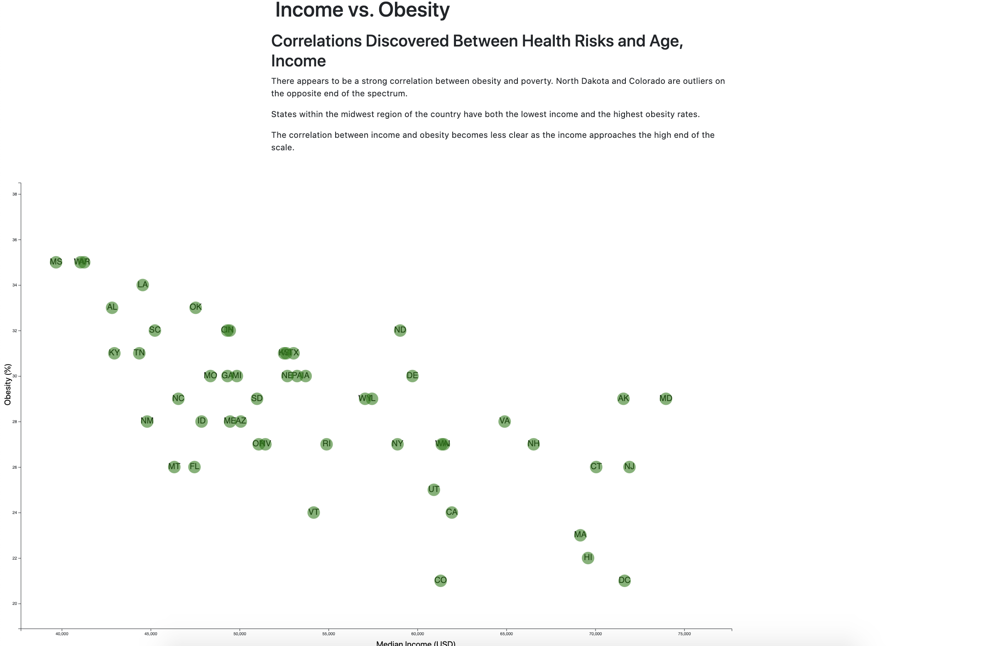

# D3 Homework - Data Journalism and D3

## Table of Contents
* [Objective](#Objective)
* [Technologies](#Technologies)
* [Process](#Process)
* [Visualization](#Visualization)

# Objective

Analyze the current trends shaping people's lives, as well as create charts, graphs, and interactive elements to help readers understand the findings.

The data set iis from the U.S. Census Bureau and the Behavioral Risk Factor Surveillance System and is based on 2014 ACS 1-year estimates: [https://factfinder.census.gov/faces/nav/jsf/pages/searchresults.xhtml](https://factfinder.census.gov/faces/nav/jsf/pages/searchresults.xhtml), but you are free to investigate a different data set. The current data set incldes data on rates of income, obesity, poverty, etc. by state. MOE stands for "margin of error."

# Technologies
* D3
* HTML
* CSS
* Javascript
* .json

# Process | 
## D3 Dabbler

Create a scatter plot between two of the data variables `Obesity vs. Poverty`.

Using D3, create a scatter plot that represents each state with circle elements in the `app.js`.

* Include state abbreviations in the circles.

* Create and situate axes and labels to the left and bottom of the chart.

* Create a static graphic when D3 lets you interact with your data?

# Visualization

